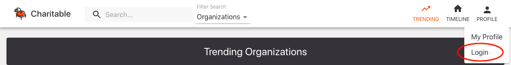
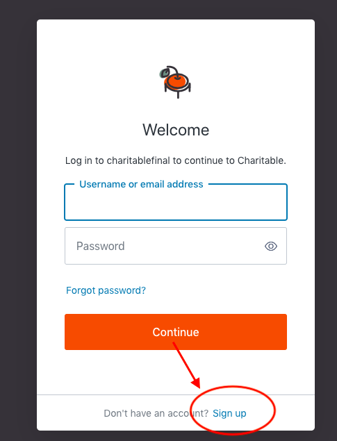
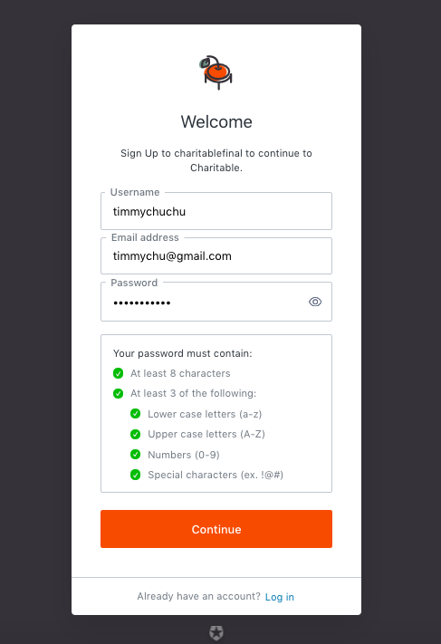
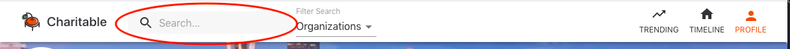
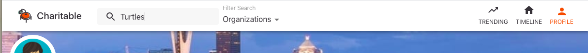
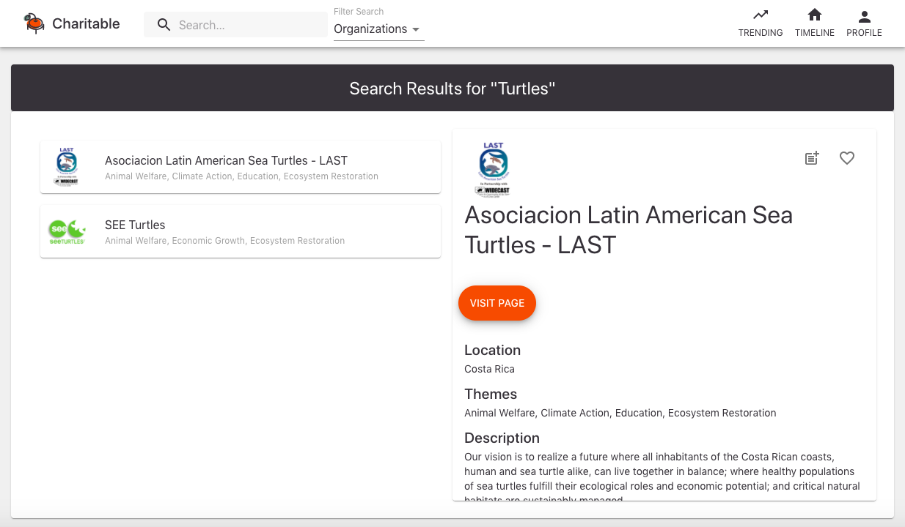
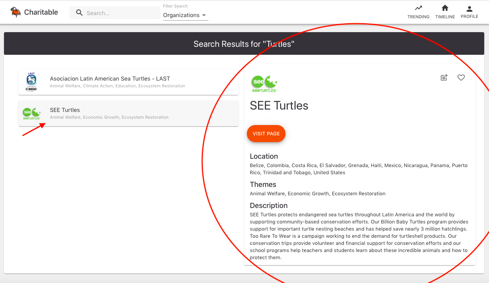
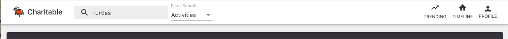
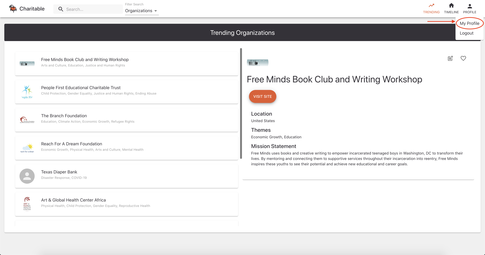
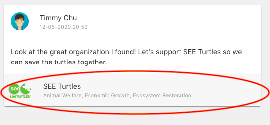

# How to use Charitable

## Welcome to Charitable.

---

If you are interesed in joining the Charitable community, keep reading!

Hi! I am Timmy Chu. I am here to help you join Charitable.

### Getting Started

To begin your Charitable journey, we simply visit Charitable's website at:

https://charitable.vercel.app/

We should see the Charitable Trending Page, which looks like this.

This page is displaying the top 10 organizations in the world! We can use the search bar at the top of each page to search for organizations and activities related to a particualar location, theme, or title.

### Signing Up

From here, we can navigate to the Login Page by clicking on the profile icon in the top right of the page. By clicking here, we will see a drop-down menu that has two items: 'My Profile", and "Login'. We can click on the "Login" option.

Now we have come to the Login Page! Since we don't have an account yet, we can click on the "Sign Up" option on the page.

To sign up you need to fill in a username, email, and password.

Once we fill out all the information we need to sign up, we have to verify our account. Simply log the email account you used to sign up and look for the "Verify Your Email" email from Charitable.

Click on the orange "Verify" button in the email. We have now successfully verified our email!

(Note: Some emails are automatically verified and will not send you a verification email, if this is the case you can go ahead and log in. The trending and profile pages are only available to verified accounts so you can visit those pages to test if you are verified.)

### Logging In

We can now log into our Charitable account. Navigate back to the Charitable website to the Login Page, and use the login credentials we just created to log in, you can login with your username or email.

### Setting Up Our Profile

Now that we have logged in, let us set up our profile! Follow the same dropdown that we used to get to the login page. This time, the dropdown menu should have the items "My Profile" and "Logout". Click "My Profile".

Once we navigate to our profile page, we can use the orange "Edit Profile" button at the far right of the banner photo on the page.

We can change our profile picture and banner photo by clicking on the "Upload Profile Picture" and "Upload Banner Picture" respectively. To add our name and a bio, we can enter them into the text fields labeled "Name" and "Bio". We have to click the "Save" button to make sure we don't lose the changes we just made!

### Editing Our Profile

To edit our profile, we can follow the same steps as we did to set up our profile to find the "Edit Profile" button. Then, by clicking on the "Edit Profile" button again, we can change any text or images that we want to change. Don't forget to click the "Save" button after making any changes to your profile!

### Searching For An Organization

Now that we have finished setting up our profile, we can start learning about Charitable organizations and activities!

To search for an organization, we can use the search bar towards the top left corner of the screen. We should see a text box with a magnifying class and the word "Search..." in it that looks like this:

To look for an organization, make sure that the "Filter Search" filter located to the right of the search bar says "Organizations". If it does not say "Organizations", simple click on the "Filter Search"- we should see a dropdowm menu with the options "Organizations", "Activities", and "Users". We can select "Organizations" from this menu.

Once "Organizations" is selected, we can type in an organization name, a theme, a location, or any other keyword that we want to find organizations for. When you are ready to search, press the "Enter" key on your keyboard. Here, I am going to look for organizations related to turtles!

When we hit the "Enter" key on our keyboard, we can see a list of organizations related to our search!

By default we can see the information of the first organization. Let's click on the other organization in the search results to learn more about what they do!

### Searching For An Activity

Now, I don't know about you, but I am excited to learn more about projects that I can get involved in to help the turtles! To search for an activity, we can do the same thing we did to search for an organization, but we need to make sure we change the "Filter Search" from "Organizations" to "Activities".

From here, just like we did for organizations, we can type in an activity title, a theme, a location, or any other keyword that we want to find activities for!

Then if we hit enter, we can see the result for our search for turtle activities.

### Saving An Organization Or Activity

If we find an organization or activity that we really like, we can save it! To save an organization or activity, we find the organization or activity we like and click on the heart icon in the top right corner. We know an item is saved when the heart is filled in.

Our saved organizations and activities can be found on our profile page! After saving an organization or activity, we can navigate to our profile page...

...and see our saved items on the right side of the page!

### Unsaving An Organization Or Activity

If we don't want an organization or activity saved anymore, we can simply click on the heard icon again. If the heart icon is not filled-in, we know that we have un-saved it.

### Searching For A User

Now that we have learned a little bit about Charitable organizations and activities, we can start buildinng our Charitable network!

Let's search for a user. Just like we searched for organizations and activities, we can use the search bar at the top of the page to search for users. We have to make sure to change the 'Filter Search" to "Users"!

To search for a user, go to the search bar that is in the top left corner of the screen and click on the dropdown to it. Select the user option, then type in the display name of the user you are looking for and press enter. I wonder if our friend Timmy Hu is on Charitable.

### Following A User

There he is! Timmy is a great friend of mine.

Let's connect with him on Charitable! Click on the search result for Timmy Hu to navigate to his profile page. Here, we can locate the orange "Follow" button on the far right under the banner photo on his profile page. Click the "Follow" button to follow Timmy!

We know that we have successfully followed Timmy when the orange "Follow" button turns to a yellow "Unfollow" button.

### Unfollowing A User

If we ever want to unfollow Timmy, we can naviage to his profile page and click the yellow "Unfollow" button. We know that we have successfully unfollowed Timmy when the yello "Unfollow" button turns into an orange "Follow" button again.

### Creating A Post

If we want to share something, we can make a post! We can create a post from either our profile page or our timeline page.

One either of these pages, we will see a box to create a post. It looks like this!

We can type something we want to share in the text box! We can even attach an image to the post if we want. Then, click Post!

If the post was successful, you should see this message:

### Sharing an Organization or Activity

One of my favortie features on Charitable is the ability to share an organization or activity. We can do this by clicking on the post + button for an organization or activity:

Doing this will share the organization or activity in a post, and we can add a caption for why we are sharing it!

After I hit post, the post will appear on my profile page and timeline so all my friends can see the great organization or activity that I have found. We will get this confirmation after we create our post. The "View on Timeline" and "View on Profile" will navigate us to the Profile and Timeline pages respectively.

Lets click on "View on Profile". Now we can view our post with the organization or activity attached. If we click on the name like so.

Then a pop up opens with all the organization or activity information, so all your friends can learn about the organization or activity. Anyone viewing the pop up can choose to save the organizatin or activity themselves as well, or also make their own post about it if they want. A great way to promote causes you care about!

### Logging Out

Whew, that was fun! When you are ready to step away from Charitable, simple use the dropdown menu in the top right corner to logout of your account until you want to log in again!

Thanks for stopping by! I hope this was helpful.

---

### Need More Help?

If you need any help with Charitable, feel free to contact the team at

Charitable401@gmail.com

---

Thanks for joining the Charitable community! We are so happy that you are here.

## We are looking forward to making your day for Charitable.
